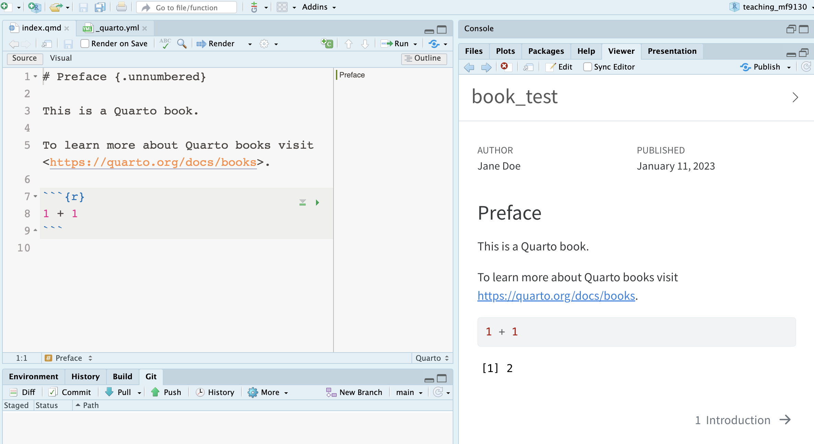
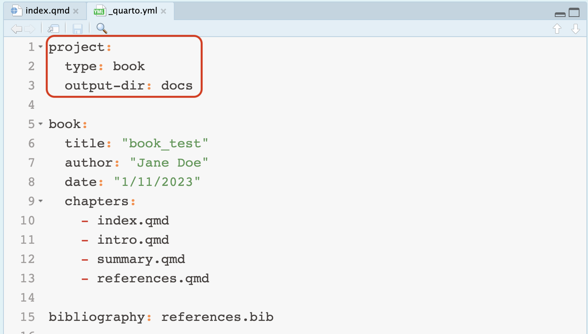
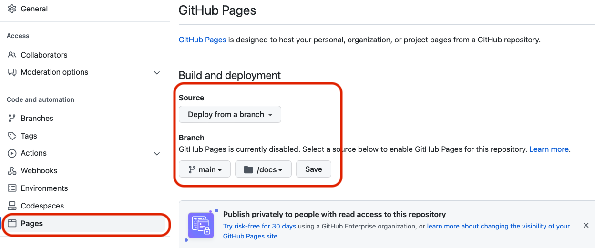
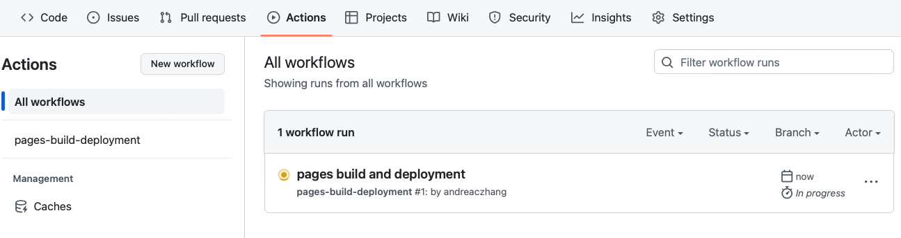
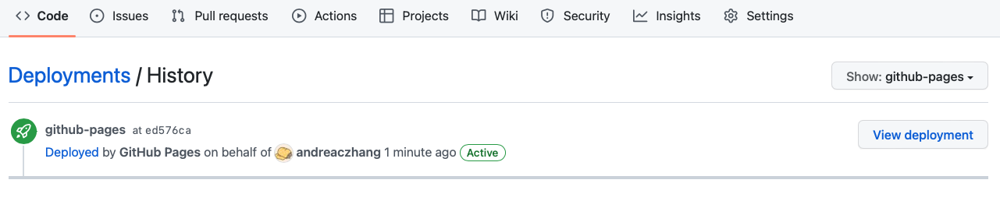
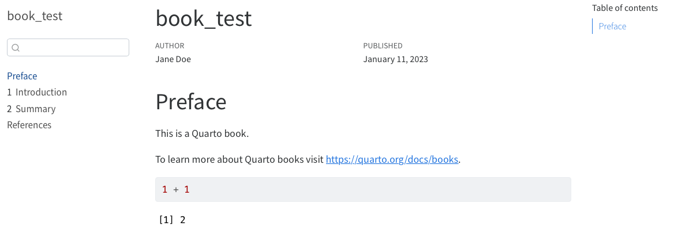

## 1. Create a public repository on GitHub

After you have the public repo, clone it to your local repo.

## 2. Create Quarto project

This can be a website, a book (a specific type of website) or something else.

Test compilation by `quarto render`, or click the `Render` button.

{width=85% fig-align="center"}

## 3. Configure Quarto project

In `_quarto.yml`, change the project configuration to use `docs` as the `output-dir`: 

```
project:
  type: website
  output-dir: docs
```

{width=85% fig-align="center"}

Then add `.nojekyll` to the root of the repository. Can do this by (in **terminal**)

```
touch .nojekyll
```

Push everything to your repository.

## 4. Configure GitHub Pages

Go to Settings > Pages, publish from `docs` of the `main` branch.

{width=85% fig-align="center"}

Can check GitHub Action and deployment status. 

{width=85% fig-align="center"}


{width=85% fig-align="center"}


After the deployment is successful, go to `view deployment`, and a successful website should be published. 

{width=85% fig-align="center"}

