> This is the very first Quarto document written in VSCode. 

- Insert a cell: `Shift + Cmd + I`

### Motivation 

The reason for switching to VSCode are three-fold:

* better collaboration with my team - adopt a developer mindset
* test out the Copilot support 
* prepare for multi-lingue work in the future

## Set up R inside VSCode

Install R. This step can be done from CRAN; or if you already have an existing installation, that works. 

Install VScode.

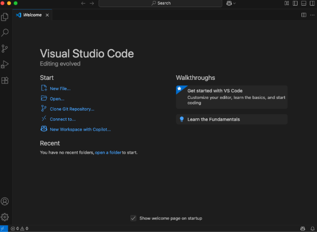{width="80%"}

Within R, install this package.

```{r}
#| eval: false
install.packages(‘languageserver’)
```

In **Marketplace**, find the **R extension**

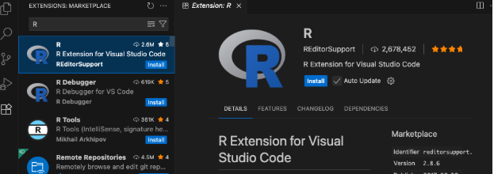{width="80%"}

Open R terminal: this is the drop-down menu on the bottom right.

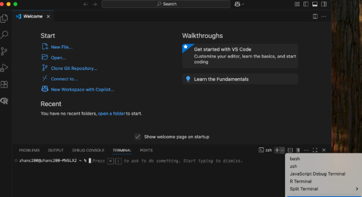{width="80%"}

Now your R environment should be set.

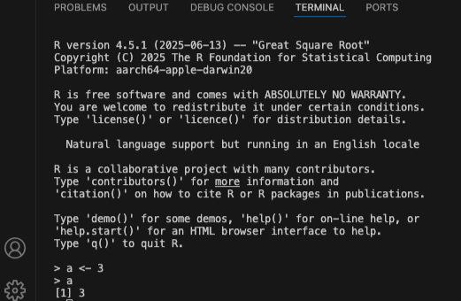{width="60%"}

Try to make a visualization, the code works but the figure looks quite bad. We try to make it better in the next section.

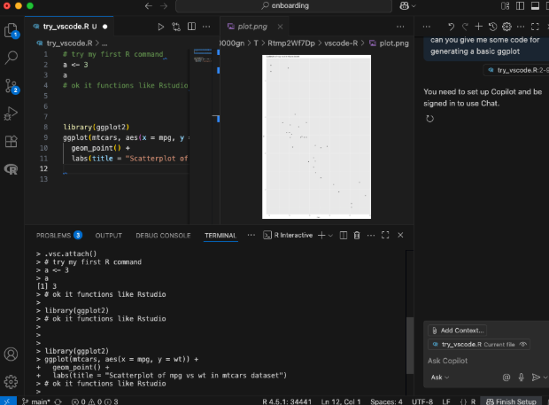{width="80%"}

## Customization

First, make it light themed. 


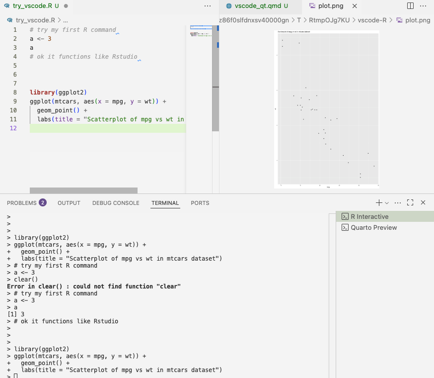{width="80%"}


### Radian

[Radian](https://github.com/randy3k/radian) is an R console that's an alternative to the default R. Follow the guide to install it.

Might need `homebrew` and `pip`.

Once the installation finished, configure within VSCode. Note that you need to specify the path to radian - if you don't know where it is installed, run `which radian` to find out.

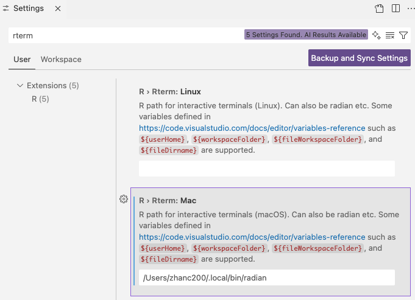{width="80%"}

Turn VSCode off and on again to activate. Now it should look slightly different than before.

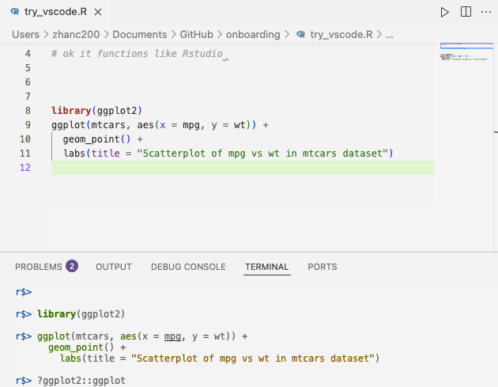{width="80%"}


### Better graphics with httpgd

First install the R package httpgd: 

```{r}
#| eval: false
install.packages(‘httpgd’)
# if unavailable on CRAN for your R version, 
# remotes::install_github("nx10/httpgd")
```

Afterwards, enable it in VSCode. You need to restart VSCode for the change to take effect.

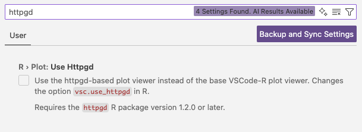{width="80%"}

Try the plot again, it should look better now!

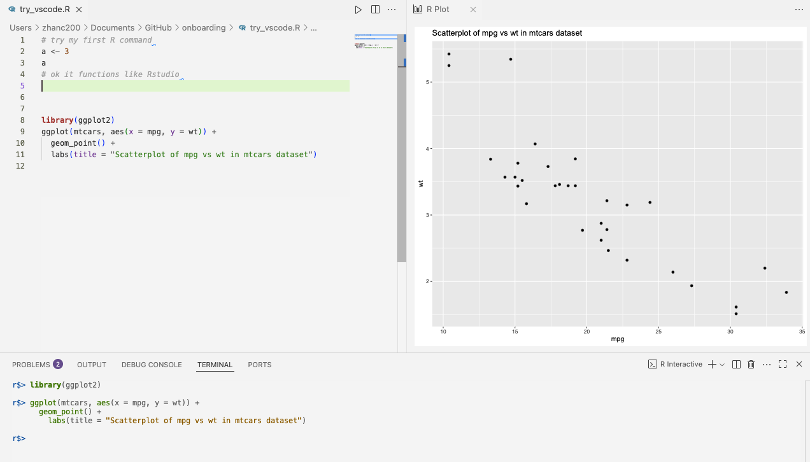{width="80%"}

## Quarto in VSCode

Quarto is a very important tool for my personal use and work. 

To set it up within a new computer (and VSCode), need to download it first. You can NOT simply install the Quarto package in R.  

Search for **Quarto extension** in VSCode. After installation, it'll prompt the *Get started with Quarto*. You can follow the guide and try to run the example document.

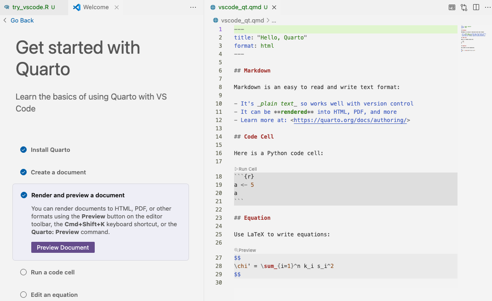{width="80%"}


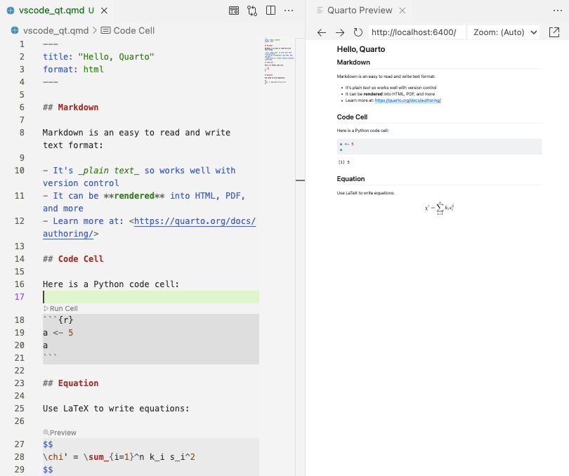{width="80%"}


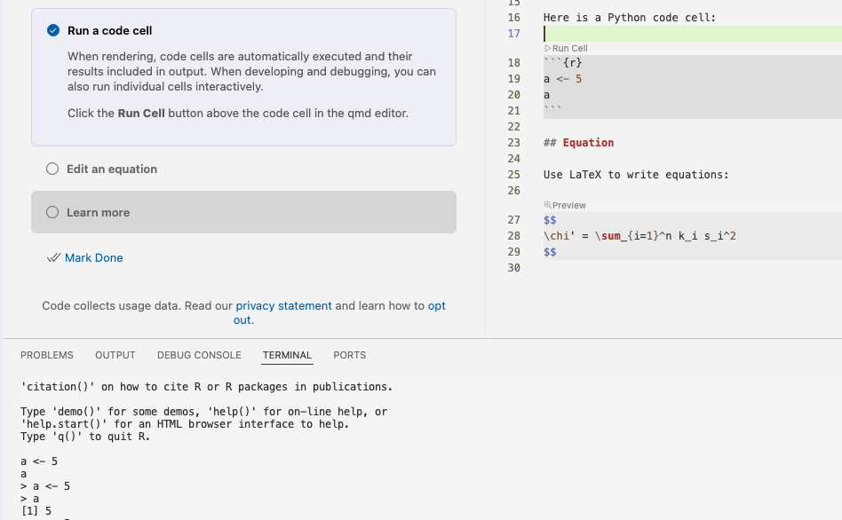{width="80%"}
 
So far so good!